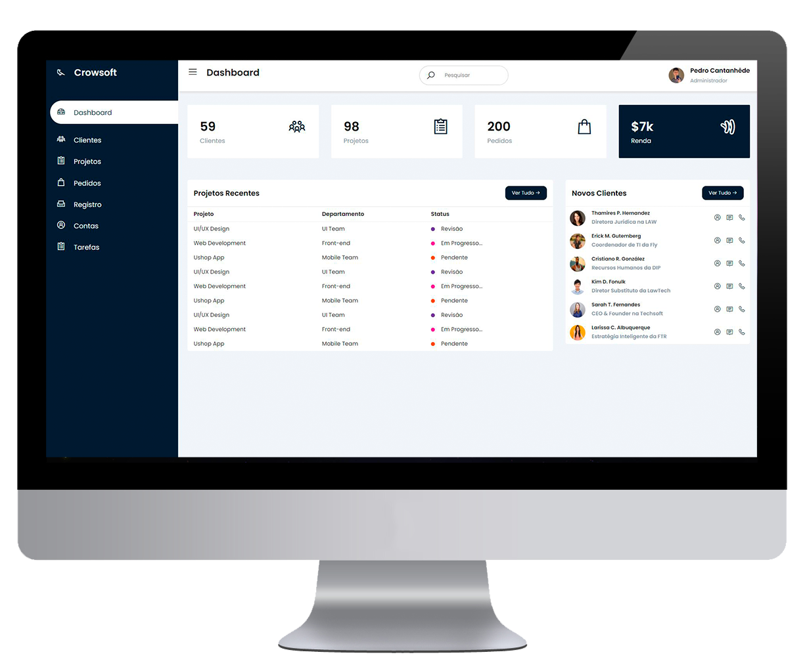
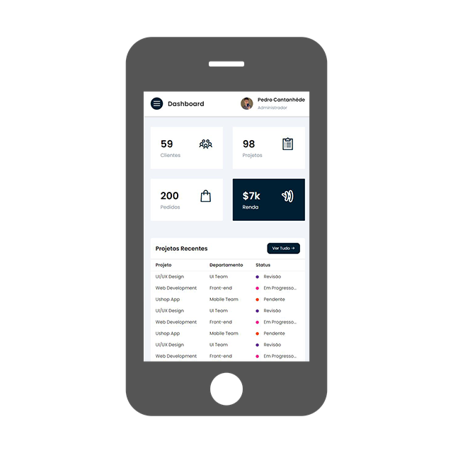
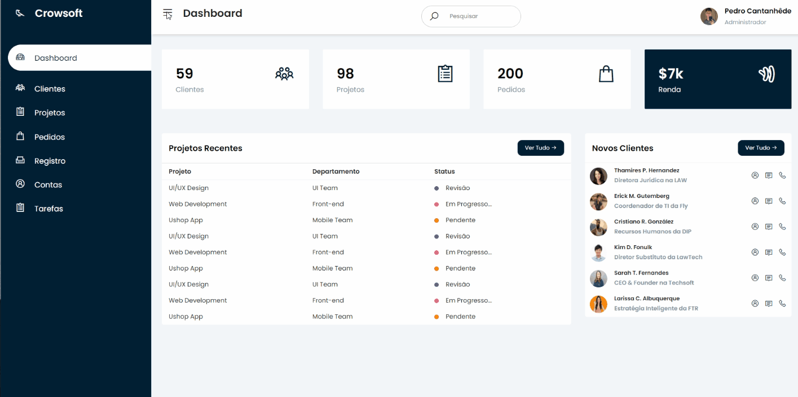
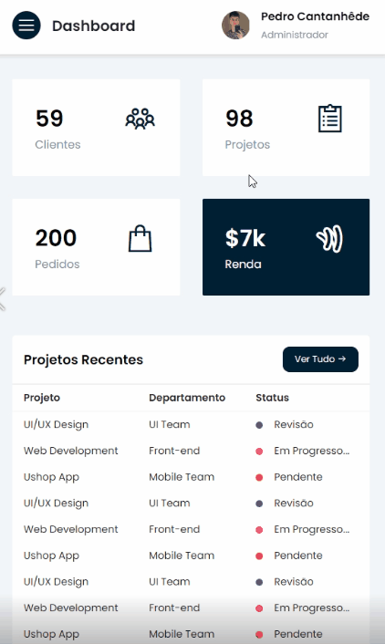
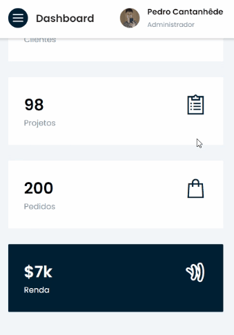
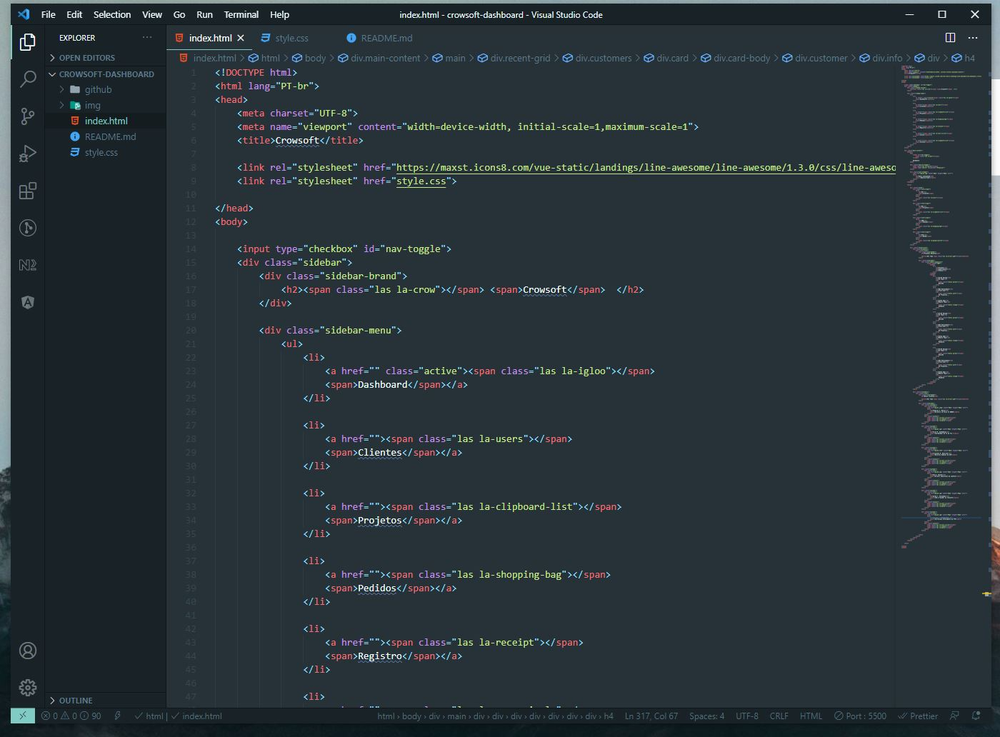

<h1 align="center">
    
</h1>

# Dashboard - Crowsoft
Projeto com o objetivo de adquirir conhecimento em HTML e CSS através do tutorial do canal Code Resource. Esta página consiste em um painel de administração, contendo modernidade e boa aparência que também pode ser utilizada em dispositivos móveis.

Link do Tutorial: https://www.youtube.com/watch?v=OJEQaVT45XA

  
  

## Com o que trabalhamos? 
✅ HTML

✅ CSS

✅ Responsividade

✅ Grid

## :camera: Veja:

### Desktop

### Mobile

### Código:

## :rocket: Tecnologia

<table>
  <thead>
    <th>HTML</th>
    <th>CSS</th>
  </thead>
  
</table>

